# CI/CD Pipeline to AWS EC2 using GitHub Actions & Docker

## 🚀 Overview
This project demonstrates a complete **Continuous Integration and Continuous Deployment (CI/CD)** pipeline for a simple Node.js application deployed to an AWS EC2 instance using **GitHub Actions** and **Docker**.

Every time code is pushed to the `main` branch:
1. GitHub Actions runs automated tests  
2. Files are securely copied to EC2  
3. EC2 rebuilds the Docker image  
4. EC2 stops and removes the old container  
5. EC2 runs the updated container  
6. The application refreshes automatically  

This replicates a **real production DevOps workflow**.

## 🧱 Technologies Used
- Node.js  
- Docker  
- Amazon Linux 2023  
- GitHub Actions  
- SSH  
- Linux Administration

## 🗂 Project Structure
nodejs_ec2_cicd_pipeline/
├── app/
│   ├── index.html
│   └── server.js
├── Dockerfile
├── .dockerignore
├── package.json
└── .github/workflows/ci-cd.yml

## 🌐 Application Files
### index.html
Static HTML served by Node.js.

### server.js
Simple HTTP server serving index.html.

## 🐳 Docker Setup
Dockerfile and .dockerignore included.

## 💻 EC2 Setup
Amazon Linux 2023, open ports: **22**, **80**, **8080**

Commands:
sudo dnf update -y
sudo dnf install docker -y
sudo systemctl start docker
sudo usermod -aG docker ec2-user

## 🔐 GitHub Secrets
EC2_HOST  
EC2_USER  
EC2_KEY  
EC2_PATH  

## 🚀 Deployment Script (deploy.sh)
Full deploy.sh included in earlier responses.

## 🔄 GitHub Actions Workflow
Located in `.github/workflows/ci-cd.yml`

## 📡 CI/CD Flow
Push → GitHub Action → Upload → Rebuild Docker → Restart container → Live update

## 🧪 Verification
Successful deployment confirmed with:
“CI/CD Pipeline Update Successful — Automated Deployment Verified 🚀”

## 🛠 Troubleshooting
Common solutions included in earlier responses.

## 🏁 Conclusion
This project delivers a complete automated CI/CD pipeline demonstrating DevOps skills in automation, cloud deployment, Docker, and GitHub Actions.

## Below are screenshots of workflow:

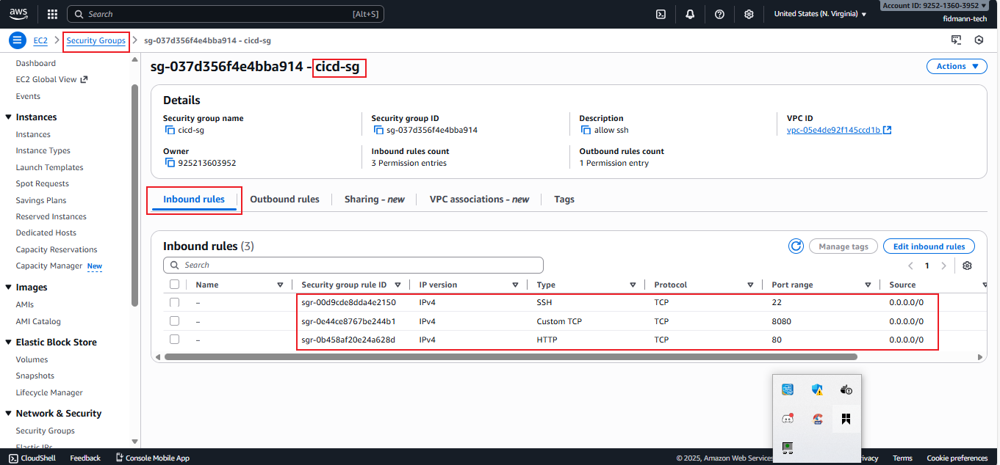
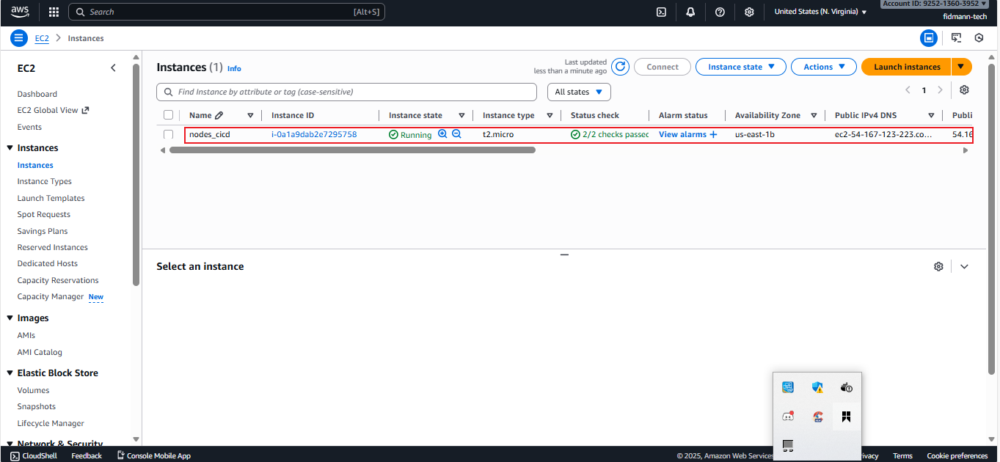

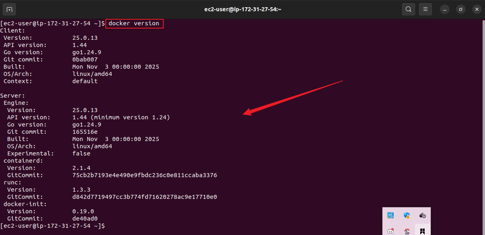
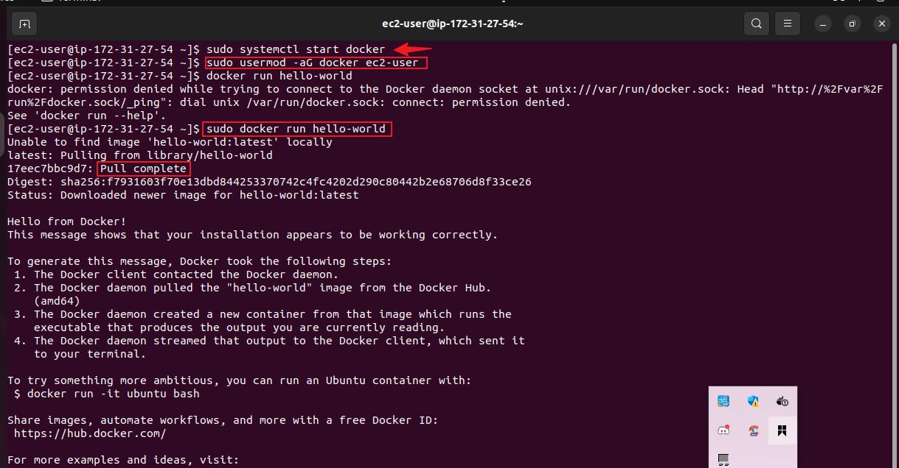
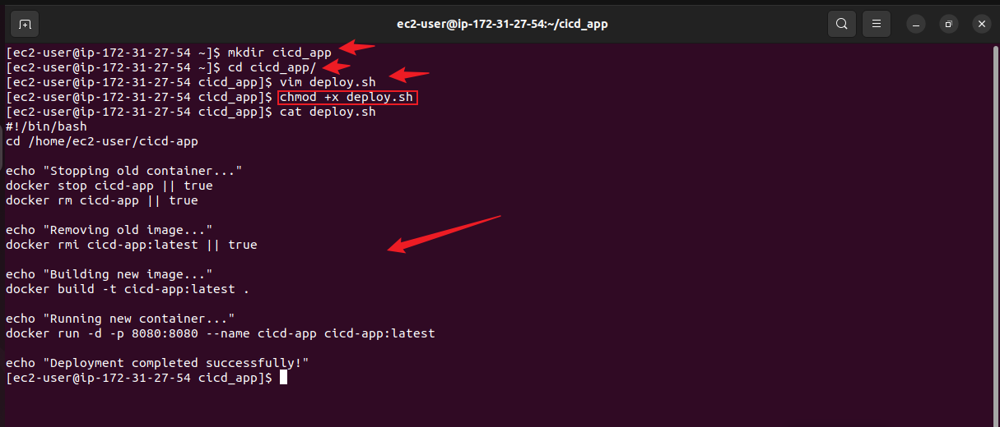
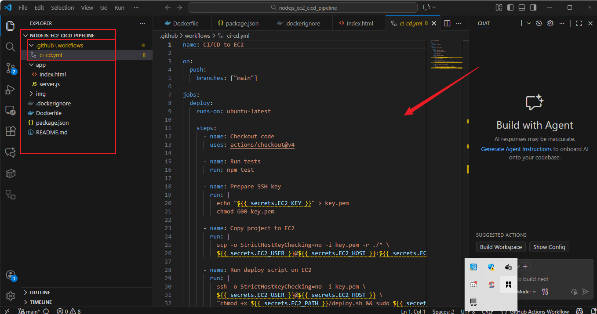
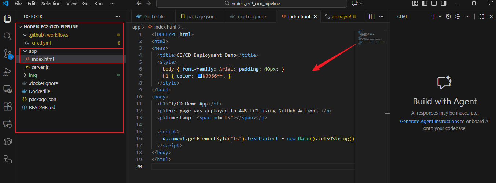
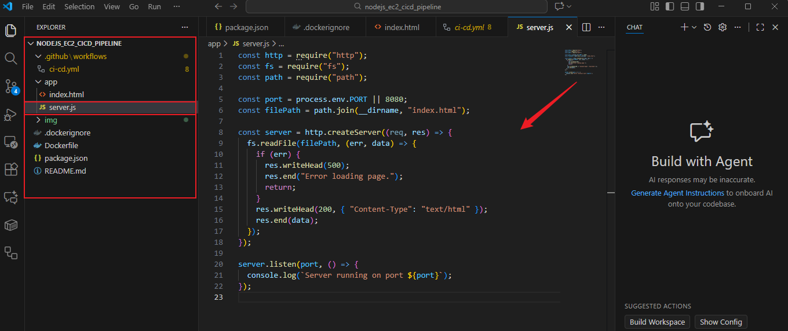
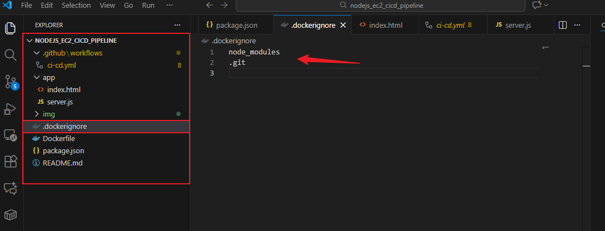
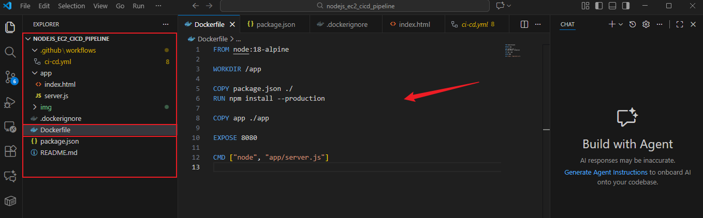
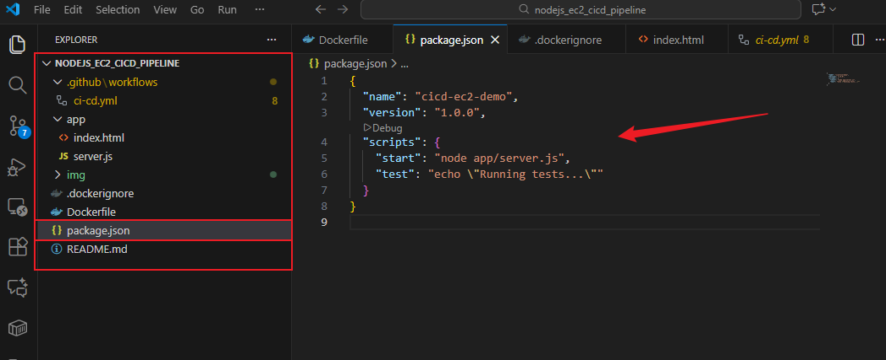
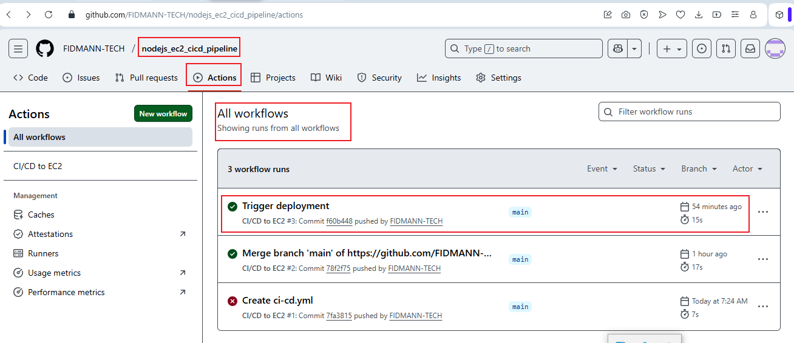
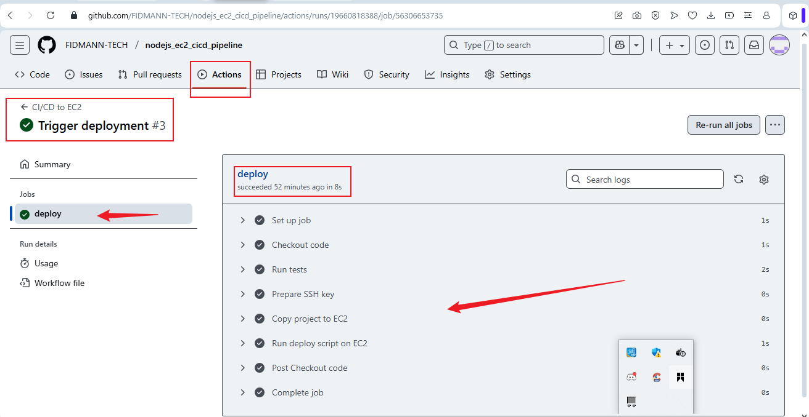

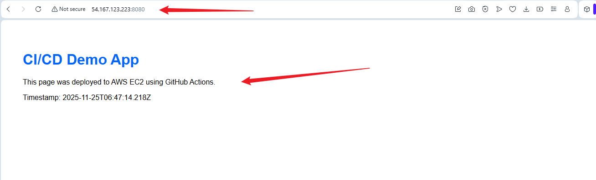
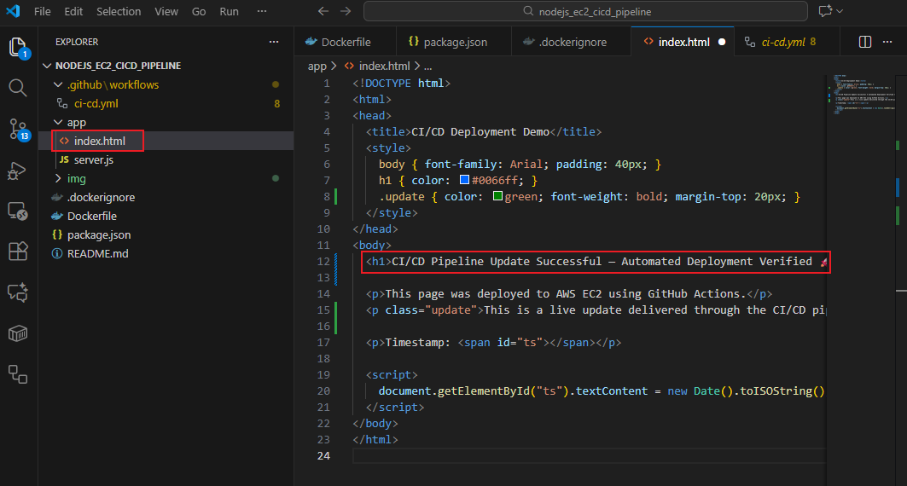
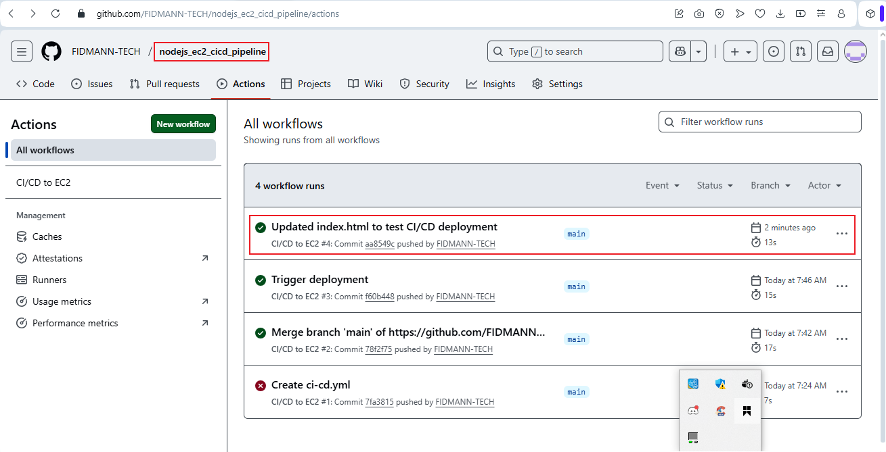
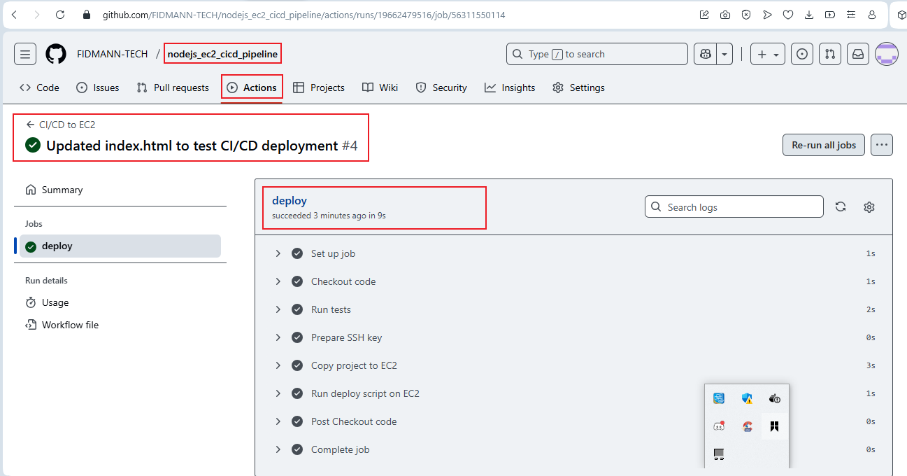
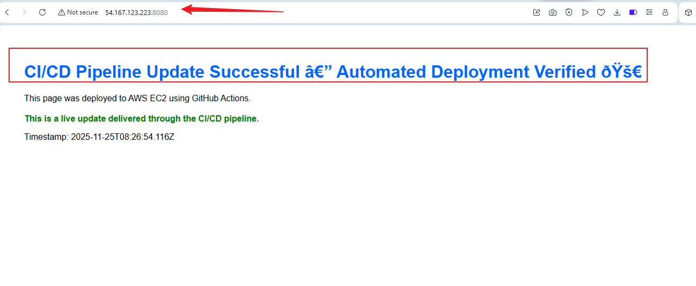
